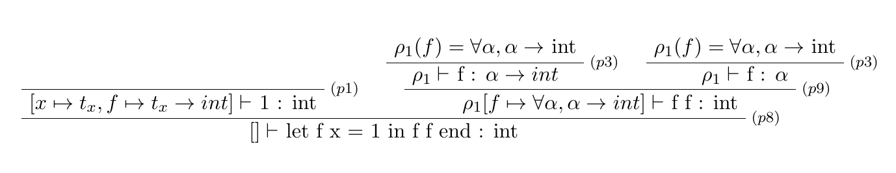
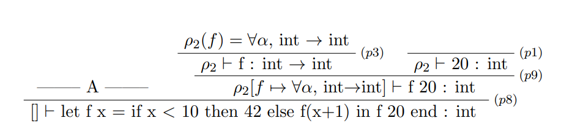
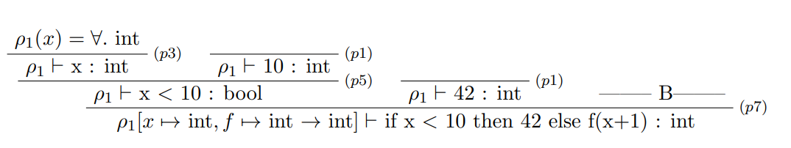
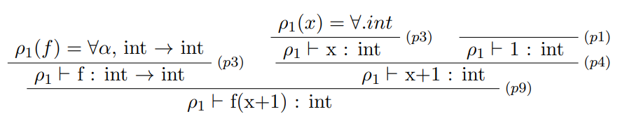

# Excercises

## Exercise 5.1

The fsharp solution can be found in `exercise5_1.fs`

```fsharp
let merge l1 l2 =
    let rec aux l1 l2 acc =
        match l1, l2 with
        | [], l2 -> List.rev l2 @ acc
        | l1, [] -> List.rev l1 @ acc
        | e1::r1, e2::r2 -> if e2 < e1 then aux (e1::r1) r2 (e2::acc) else aux r1 (e2::r2) (e1::acc)
    aux l1 l2 [] |> List.rev;;
```

The C# solution can be found in `exercise5_1.java`

```csharp
static int[] merge (int[] xs, int[] ys) {
        int[] merged = new int[ys.Length + xs.Length];
        int xi = 0;
        int yi = 0;
        while (xi < xs.Length || yi < ys.Length) {
            if (xi == xs.Length || xs.Length == 0) {
                merged[xi+yi] = ys[yi];
                yi++;
            } else if (yi == ys.Length  || ys.Length == 0) {
                merged[xi+yi] = xs[xi];
                xi++;
            } else if (xs[xi] > ys[yi]) {
                merged[xi+yi] = ys[yi];
                yi++;
            } else {
                merged[xi+yi] = xs[xi];
                xi++;
            }
        }
        return merged;
    }
```

## Exercise 5.7

`TypedFun.fs`

```fsharp
type typ =
  | TypI                                (* int                         *)
  | TypB                                (* bool                        *)
  | TypL of typ                         // NEW
  | TypF of typ * typ                   (* (argumenttype, resulttype)  *)

  ...

let rec typ (e : tyexpr) (env : typ env) : typ =
  match e with
  | CstI i -> TypI
  | CstB b -> TypB
  | CstL l -> TypL TypI         //<NEW>
  | Var x  -> lookup env x 
  ...
```

## Exercise 6.1

`dotnet fsi -r FsLexYacc.Runtime.dll Absyn.fs FunPar.fs FunLex.fs Parse.fs HigherFun.fs ParseAndRunHigher.fs`

Input and output from F# interactive

```fsharp
> open ParseAndRunHigher;;
> fromString "let add x = let f y = x+y in f end in add 2 5 end";;
val it: Absyn.expr = 
  Letfun
    ("add", "x", Letfun ("f", "y", Prim ("+", Var "x", Var "y"), Var "f"),
     Call (Call (Var "add", CstI 2), CstI 5))
> run it;;
val it: HigherFun.value = Int 7

> fromString "let add x = let f y = x+y in f end in let addtwo = add 2 in addtwo 5 end end";;
val i: Absyn.exprt = 
  Letfun
    ("add", "x", Letfun ("f", "y", Prim ("+", Var "x", Var "y"), Var "f"),
     Let ("addtwo", Call (Var "add", CstI 2), Call (Var "addtwo", CstI 5)))
> run it;; 
val it: HigherFun.value = Int 7

> fromString "let add x = let f y = x+y in f end in let addtwo = add 2 in let x = 77 in addtwo 5 end end end";;
val it: Absyn.expr = 
  Letfun
    ("add", "x", Letfun ("f", "y", Prim ("+", Var "x", Var "y"), Var "f"),
     Let
       ("addtwo", Call (Var "add", CstI 2),
        Let ("x", CstI 77, Call (Var "addtwo", CstI 5))))
> run it;; 
val it: HigherFun.value = Int 7

> fromString "let add x = let f y = x+y in f end in add 2 end";;
val it: Absyn.expr =
  Closure
    ("f", "y", Prim ("+", Var "x", Var "y"),
     [("x", Int 2);
      ("add",
       Closure
         ("add", "x", Letfun ("f", "y", Prim ("+", Var "x", Var "y"), Var "f"),
          []))])
> run it;;
val it: HigherFun.value =
  Closure
    ("f", "y", Prim ("+", Var "x", Var "y"),
     [("x", Int 2);
      ("add",
       Closure
         ("add", "x", Letfun ("f", "y", Prim ("+", Var "x", Var "y"), Var "f"),
          []))])
```

The result of running the 3rd program is 7, as we expected, since the binding (x = 77) happens in a different scope than the function addtwo, it has no effect on the function, addtwo still has x bound to 2, not 77.

The 4th program returns a closure for the function add, where the variable x is bound to 2 (This can be seen as the function addtwo, in previous programs).

## Exercise 6.2

These were the changes we made:

`Absyn.fs`

```fsharp
type expr =
  | CstI of int
  | CstB of bool
  | Var of string
  | Let of string * expr * expr
  | Prim of string * expr * expr
  | If of expr * expr * expr
  | Letfun of string * string * expr * expr    (* (f, x, fBody, letBody) *)
  | Fun of string * expr                       //<NEW>
  | Call of expr * expr
```

`HigherFun.fs`

```fsharp
...

type value =
  | Int of int
  | Closure of string * string * expr * value env       (* (f, x, fBody, fDeclEnv) *)
  | Clos of string * expr * value env                   // <NEW>

...

let rec eval (e : expr) (env : value env) : value =
    match e with
...
| Fun(x, fbody) ->                        // <New>
      Clos(x, fbody, env)                     // <New>
    | Call(eFun, eArg) ->
      let fClosure = eval eFun env  (* Different from Fun.fs - to enable first class functions *)
      match fClosure with
      | Closure (f, x, fBody, fDeclEnv) ->
        let xVal = eval eArg env
        let fBodyEnv = (x, xVal) :: (f, fClosure) :: fDeclEnv
        in eval fBody fBodyEnv
      | Clos (x, fBody, fDeclEnv) ->          // <New>
        let xVal = eval eArg env              // <New>
        let fBodyEnv = (x, xVal) :: fDeclEnv  // <New>
        in eval fBody fBodyEnv                // <New>
      | _ -> failwith "eval Call: not a function";;
```

Input and output from F# interactive

```fsharp
> open Absyn;;
> open HigherFun;;
> open ParseAndRunHigher;;
> Fun("x", Prim("*", CstI 2, Var "x"))
val it: expr = Fun ("x", Prim ("*", CstI 2, Var "x"))

> run it;;  
val it: value = Clos ("x", Prim ("*", CstI 2, Var "x"), [])

> Let("y", CstI 22, Fun("z", Prim("+", Var "z", Var "y")));;
val it: expr = Let ("y", CstI 22, Fun ("z", Prim ("+", Var "z", Var "y")))

> run it;;
val it: value = Clos ("z", Prim ("+", Var "z", Var "y"), [("y", Int 22)])
```

Giving the two examples of abstract syntax in the exercise, produces the expected result.

## Exercise 6.3

`FunLex.fsl`

```text
let keyword s =
    match s with
    ...
    | "fun"   -> FUN        //<NEW>
    ...

rule Token = parse
  ...
  | "->"            { AF }          //<New>
  ...
```

``FunPar.fsy`

```text
...

%token ELSE END FALSE IF IN FUN LET NOT THEN TRUE //<NEW>
%token PLUS MINUS TIMES DIV MOD
%token EQ NE GT LT GE LE AF                       //<NEW>
%token LPAR RPAR 
%token EOF

%left ELSE              /* lowest precedence  */
%left EQ NE AF                                    //<NEW>
%left GT LT GE LE
%left PLUS MINUS
%left TIMES DIV MOD
%nonassoc NOT           /* highest precedence  */

...

Expr:
  ...
  | FUN NAME AF Expr                    { Fun($2, $4)            } //<NEW>
  ...


```

We run the following commands, they produce no errors:
`fsyacc --module FunPar FunPar.fsy`
`fslex --unicode FunLex.fsl`

Input and output from F# interactive

```fsharp
> open ParseAndRunHigher;;
> fromString "let add x = fun y -> x+y in add 2 5 end";;
val it: Absyn.expr =
  Letfun
    ("add", "x", Fun ("y", Prim ("+", Var "x", Var "y")),
     Call (Call (Var "add", CstI 2), CstI 5))

> run it;;
val it: HigherFun.value = Int 7

> fromString "let add = fun x -> fun y -> x+y in add 2 5 end";;
val it: Absyn.expr =
  Let
    ("add", Fun ("x", Fun ("y", Prim ("+", Var "x", Var "y"))),
     Call (Call (Var "add", CstI 2), CstI 5))

> run it;;
val it: HigherFun.value = Int 7
```

## Exercise 6.4

(i)
This is polymorphic since the parameter x is never used, thus the type of the given argument does not matter. Type: a -> int


(ii)
This is not polymorphic since the parameter x can only have the type int, for the type inference to succeed.
This type rule tree had to be divided into several parts. See parts A and B below.



**A:**


**B:**


## Exercise 6.5

`dotnet fsi -r FsLexYacc.Runtime.dll Absyn.fs FunPar.fs FunLex.fs Parse.fs TypeInference.fs ParseAndType.fs`

(i)
Below is shown the execution in f#-interactive.
```fsharp
> open ParseAndType.fs;;
> inferType (fromString "let f x = 1 in f f end");;
val it: string = "int"

> inferType (fromString "let f g = g g in f end");;
System.Exception: type error: circularity ...

> inferType (fromString "let f x = let g y = y in g false end in f 42 end");;
val it: string = "bool"

> inferType (fromString "let f x = let g y = if true then y else x in g false end in f 42 end");;
System.Exception: type error: bool and int ...

> inferType (fromString "let f x = let g y = if true then y else x in g false end in f true end");;
val it: string = "bool"
```

Type inference fails for the following programs:
- `let f g = g g in f end`, here the error 'circularity' occurs. Take the following example:
```
let f g = g g

f (a -> b)

g = (b -> c)

g = (b -> (b -> c))

g = (b -> (b -> (b -> c)))
```
   g must accept itself, thus resulting in a recursive type definition... This is not right.The type checker cannot know the final type since there is no final type.
-  `let f x = let g y = if true then y else x in g false end in f 42 end`, which results in a 'bool and int' error.This is since the function g can both return an int and a bool depending on which branch of the if-statement is entered. If the type wasn't checked statically, then there wouldn't be a problem, since the function g could only return a bool.

(ii)
**(bool -> bool):**
`let f x = if x then true else false in f end`

**(int -> int):**
`let f x = x + 1 in f end`

**(int -> int -> int):**
`let f x = let g y = y + x in g end in f end`

**('a -> 'b -> 'a):**
`let f x = let g y = x in g end in f end`

**('a -> 'b -> 'b):**
`let f x = let g y = y in g end in f end`

We were unable to construct programs for the final 3 types.

Here is the execution in f#-interactive
```f#
> inferType (fromString "let f x = if x then true else false in f end");;
val it: string = "(bool -> bool)"

> inferType (fromString "let f x = x + 1 in f end");;
val it: string = "(int -> int)"

> inferType (fromString "let f x = let g y = y + x in g end in f end");;
val it: string = "(int -> (int -> int))"

> inferType (fromString "let f x = let g y = x in g end in f end");;
val it: string = "('h -> ('g -> 'h))"

> inferType (fromString "let f x = let g y = y in g end in f end");;
val it: string = "('g -> ('h -> 'h))"
```